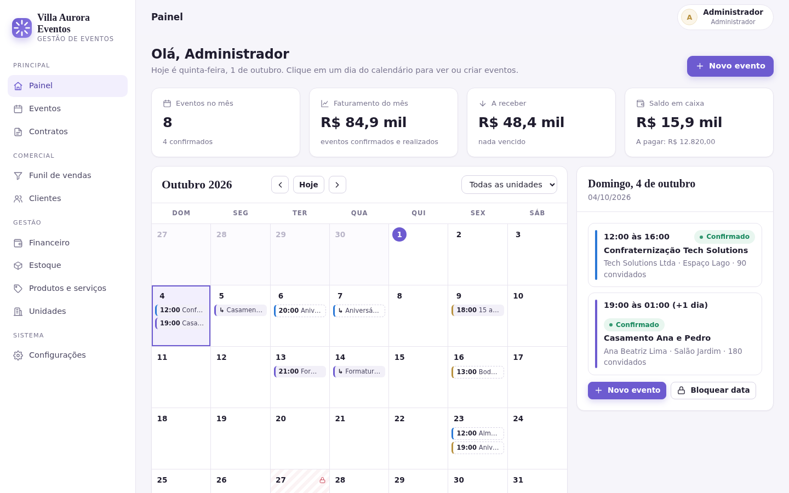
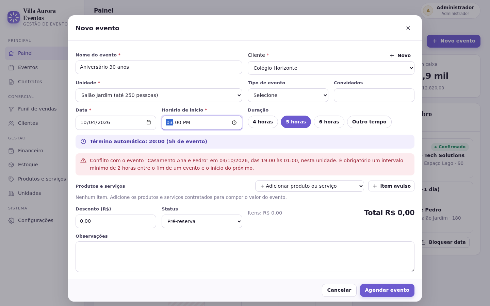
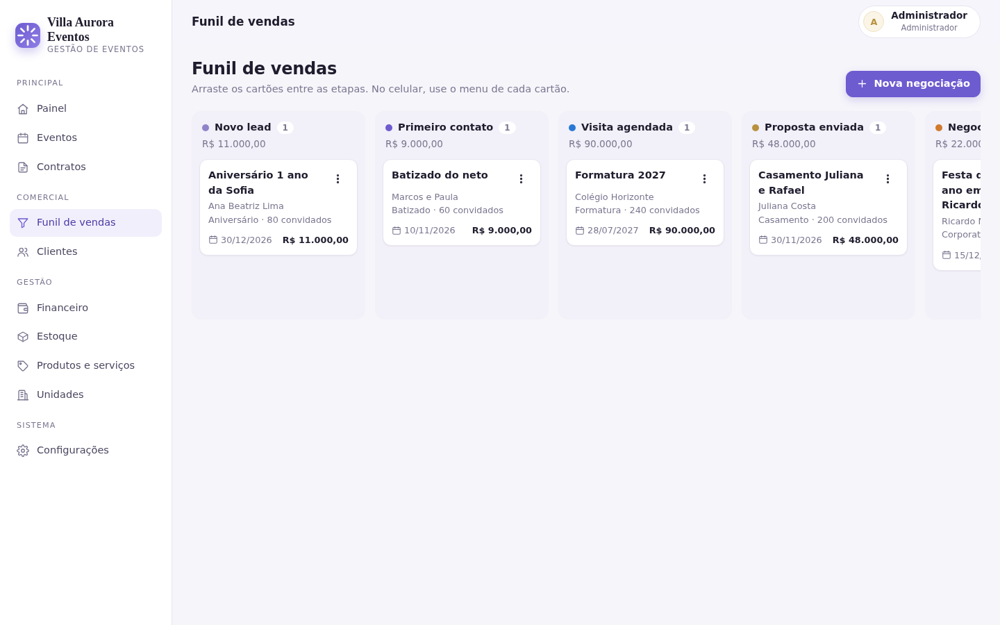
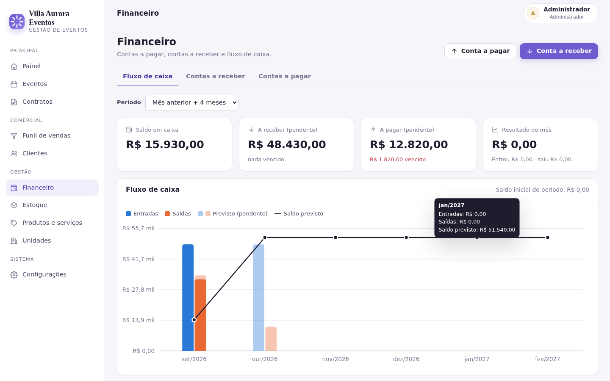

# Gestão de Eventos (ERP + CRM)

Sistema web para empresas de eventos. Junta agenda das unidades, clientes, funil de vendas, contratos, financeiro e estoque num lugar só, com envio de contrato e formulário pelo WhatsApp. Funciona no computador, tablet e celular.

## Telas

| Painel com calendário | Novo evento barrando conflito |
|---|---|
|  |  |
| **Funil de vendas** | **Fluxo de caixa** |
|  |  |

No celular: [painel](docs/screenshots/10-celular-painel.png) e [menu](docs/screenshots/11-celular-menu.png). As demais telas estão em `docs/screenshots`.

## Como rodar

Precisa do Node.js 22.13 ou mais novo. Não tem etapa de build e o banco é um arquivo SQLite (usa o `node:sqlite` nativo do Node, sem dependência compilada).

```bash
npm install
cp .env.example .env      # ajuste ADMIN_EMAIL, ADMIN_PASSWORD e APP_URL
npm start                 # http://localhost:3000
```

Na primeira execução o sistema cria o administrador com o e-mail e a senha do `.env`. Se `ADMIN_PASSWORD` ficar vazio, ele gera uma senha aleatória, mostra uma única vez no console e obriga a troca no primeiro acesso.

Para testar com dados prontos (unidades, clientes, eventos, parcelas, funil):

```bash
npm run seed:demo
```

Isso cria também um usuário de cada perfil com a senha `Demo12345`: `gerente@demo.com`, `financeiro@demo.com`, `comercial@demo.com` e `operador@demo.com`. O comando só roda em banco vazio.

Outros comandos:

```bash
npm test        # testes das regras de agenda e da API
npm run lint    # ESLint
npm run dev     # reinicia sozinho ao salvar arquivos
```

## Módulos

| Tela | O que faz |
|---|---|
| Painel | Indicadores do mês e calendário. Clicar num dia mostra os eventos dele e permite criar evento ou bloquear a data. |
| Eventos | Lista com filtros por período, unidade e status. A ficha do evento reúne itens, parcelas, contrato, formulários e baixa de estoque. |
| Contratos | Emitidos a partir do evento usando o modelo da empresa. O cliente lê e dá o aceite online pelo link; também dá para registrar assinatura em papel. |
| Funil de vendas | Kanban com 7 etapas (arrastar e soltar no computador, menu do cartão no celular). Ao ganhar uma negociação, o sistema oferece agendar o evento. |
| Clientes | Cadastro PF/PJ, histórico de contatos, eventos, negociações e respostas de formulários. |
| Financeiro | Contas a pagar e a receber, baixa com valor pago, estorno e fluxo de caixa realizado e previsto. |
| Estoque | Saldo por produto e por unidade, entrada, saída, ajuste de inventário, transferência entre unidades e consumo pelo evento. |
| Produtos e serviços | Itens que compõem o valor do evento. Produtos controlam estoque, serviços não. |
| Unidades | Nome, local, capacidade e cor na agenda. |
| Configurações | Usuários, matriz de permissões, dados da empresa, modelo de contrato, mensagens do WhatsApp e auditoria. |

## Regras de agenda

Todas são checadas no servidor, então não dá para contornar pelo navegador.

- **Sem choque na mesma unidade.** Dois eventos ativos não podem se sobrepor na mesma unidade. Eventos cancelados liberam o horário.
- **Intervalo mínimo de 2 horas.** Se um evento termina às 16h, o próximo na mesma unidade só começa a partir das 18h. A regra vale nos dois sentidos e também para eventos que viram a madrugada.
- **Horário final automático.** O usuário escolhe início e duração (4h, 5h, 6h ou "Outro tempo", de 1h a 24h em blocos de 15 min). O término é calculado e mostrado na hora.
- **Sugestão de horário.** Quando há conflito, o formulário avisa antes de salvar e sugere o primeiro horário livre do dia.
- **Bloqueio de datas.** Só Administrador e Gerente bloqueiam datas, para todas as unidades ou para uma só, um dia ou um período. Datas que já têm evento não podem ser bloqueadas, e nenhum evento pode tocar uma data bloqueada (nem um evento que começa na véspera e termina nela).
- **Capacidade.** O número de convidados não pode passar da capacidade da unidade.
- **Reativação.** Um evento cancelado só volta se o horário ainda estiver livre.

Exemplo: o Salão Jardim tem um casamento das 19h à 01h. Tentar agendar outro evento no mesmo salão às 15h com 4 horas de duração é recusado, porque ele terminaria às 19h e não sobram as 2 horas de intervalo. Às 12h com 4 horas (até 16h) passa.

## Perfis e permissões

| Módulo | Admin | Gerente | Financeiro | Comercial | Operador |
|---|---|---|---|---|---|
| Painel e agenda | editar | editar | ver | editar | ver |
| Bloquear datas | sim | sim | não | não | não |
| Clientes e funil | editar | editar | ver | editar | não |
| Contratos | editar | editar | ver | editar | não |
| Financeiro | editar | editar | editar | não | não |
| Estoque | editar | editar | ver | ver | editar |
| Produtos e unidades | editar | editar | ver | ver | ver |
| WhatsApp | sim | sim | sim | sim | não |
| Usuários e auditoria | sim | não | não | não | não |

A matriz fica em `src/lib/permissions.js` e cada rota da API confere a permissão antes de executar.

## WhatsApp

Funciona de dois jeitos:

1. **Sem configuração (padrão):** o sistema monta a mensagem com o link do contrato ou do formulário e mostra um botão que abre o WhatsApp de quem está usando (`wa.me`), já com o texto pronto.
2. **WhatsApp Cloud API (Meta):** com `WHATSAPP_TOKEN` e `WHATSAPP_PHONE_NUMBER_ID` no `.env`, a mensagem sai direto do sistema. Se a API falhar, ele volta para o link.

Pela ficha do cliente, do evento, do contrato ou do lançamento financeiro dá para chamar o cliente, enviar o contrato, enviar formulário de cadastro ou briefing e mandar lembrete de cobrança. Todo envio fica registrado no histórico do cliente.

A Meta só aceita mensagem livre quando o cliente falou com a empresa nas últimas 24 horas. Fora dessa janela é preciso usar um modelo (template) aprovado, então para contato frio o modo link costuma ser mais prático.

Os links públicos usam tokens aleatórios de 256 bits. Formulários expiram em 15 dias e só aceitam uma resposta.

## Segurança

- Senhas com `scrypt` e sal individual. Mínimo de 8 caracteres com letras e números.
- Sessão em cookie `HttpOnly`, `SameSite=Strict` e `Secure` em produção (prefixo `__Host-`). O token da sessão é guardado só como hash no banco.
- Proteção CSRF com token por sessão no cabeçalho `X-CSRF-Token` e checagem de origem.
- Bloqueio da conta por 15 minutos após 5 senhas erradas e limite de requisições no login, na API e nas rotas públicas.
- Cabeçalhos de segurança com Helmet e CSP restrita (só scripts e estilos do próprio domínio).
- Consultas SQL sempre parametrizadas e validação de entrada com Zod.
- O front monta a tela com `textContent`, nunca com HTML vindo do banco, o que fecha a porta para XSS.
- Auditoria das ações sensíveis (login, alterações, pagamentos, bloqueios, aceite de contrato com IP).
- Troca de perfil ou desativação derruba as sessões do usuário. O sistema não deixa ficar sem administrador ativo.

Para produção: rode atrás de HTTPS, defina `NODE_ENV=production`, `APP_URL` com o domínio real e `TRUST_PROXY=1` se houver proxy reverso. Faça backup do arquivo do banco (`data/erp.db`).

## Estrutura

```
src/
  server.js            inicialização
  app.js               Express, segurança e rotas
  config.js            leitura do .env
  db/                  migrações, criação do admin e dados de demonstração
  lib/eventRules.js    regras de agenda (funções puras, testadas)
  lib/schedule.js      checagem de conflito, bloqueio e capacidade no banco
  lib/permissions.js   matriz de perfis
  routes/              uma rota por módulo
public/
  index.html           aplicação (SPA sem build, módulos ES)
  contract.html        página pública do contrato
  form.html            página pública do formulário
  js/views/            uma tela por módulo
  js/components/       formulário de evento, cliente e janela do WhatsApp
test/                  testes com node:test
```
